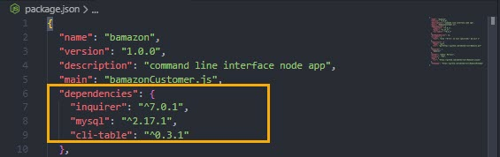

# Bamazon
Use Bamazon to purchase your favorite items!

## Before You Begin
Bamazon is a command-line interface application. To retrieve the data that will power this app, you'll need to send requests using the following node packages and API's:

* NPM Packages: [Inquirer](https://www.npmjs.com/package/inquirer), [MySQL](https://www.npmjs.com/package/mysql), [CLI-Table](https://www.npmjs.com/package/cli-table)

* Application: [MySQL Community Server](https://dev.mysql.com/downloads/mysql/)

    * Refer to [MySQL Reference Manual](https://dev.mysql.com/doc/refman/8.0/en/installing.html) documentation for steps to install the software on your workstation.

## Instructions

1. Clone this repository [Bamazon](https://github.com/adotmorrall/Bamazon.git)

2. Install all the required NPM packages.

    ```js
    npm install inquirer
    npm install mysql
    npm install cli-table // Utility that allows you to render unicode-aided tables on the command line from your node.js scripts.
    ```
3. Open your ```package.json``` file, and make sure the package names shows underneath the dependencies.

    

4. Run the ```bamazon.sql``` file in MySQL.

## How to use Bamazon

Now that the under the hood work is complete, here's how to use Bamazon!

Open the **Bamazon** folder, and then run the following command from the terminal: `node bamazonCustomer.js`.

You should now see a table that displays the following:

- Id
- Products
- Departments
- Price

You're prompted to type in the **Id** to select the item you'd like the purchase. Next, you type in the amount you'd like to buy.

Notice in the demo that if you try to buy more items than what's in stock, you're alerted to select a lower quantity or choose another product. Also, if you mistype your Id, you can start over. Lastly, if your item is in stock, your order will be processed.

**Demo**


### Technologies

* Node.js
* JavaScript

### Future application enhancements

* Implement feature to confirm the user's Id selection before processing the order
* Select multiple items to purchase
* Implement Bamazon Manager and Supervisor options to view product sales